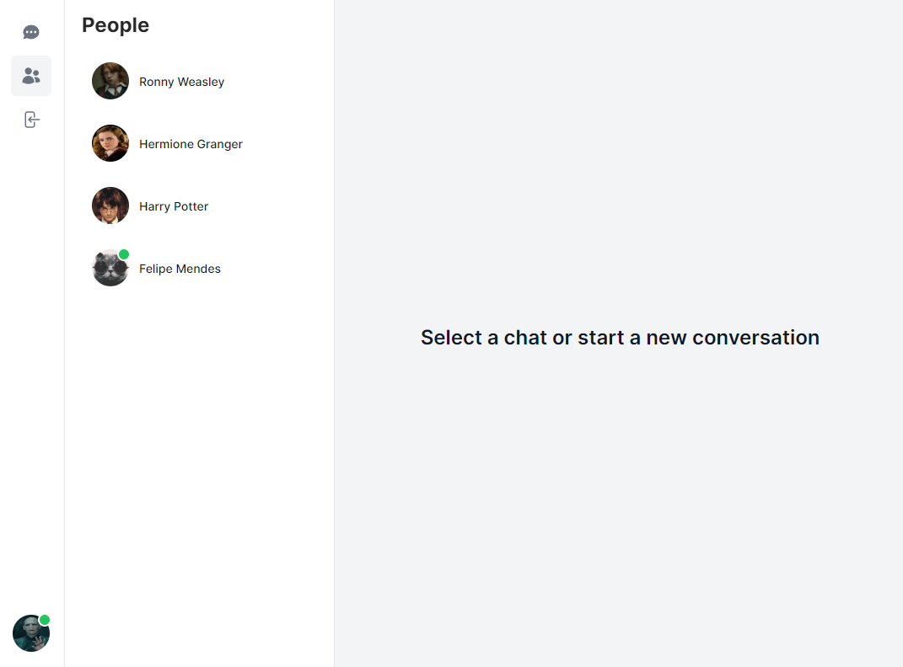
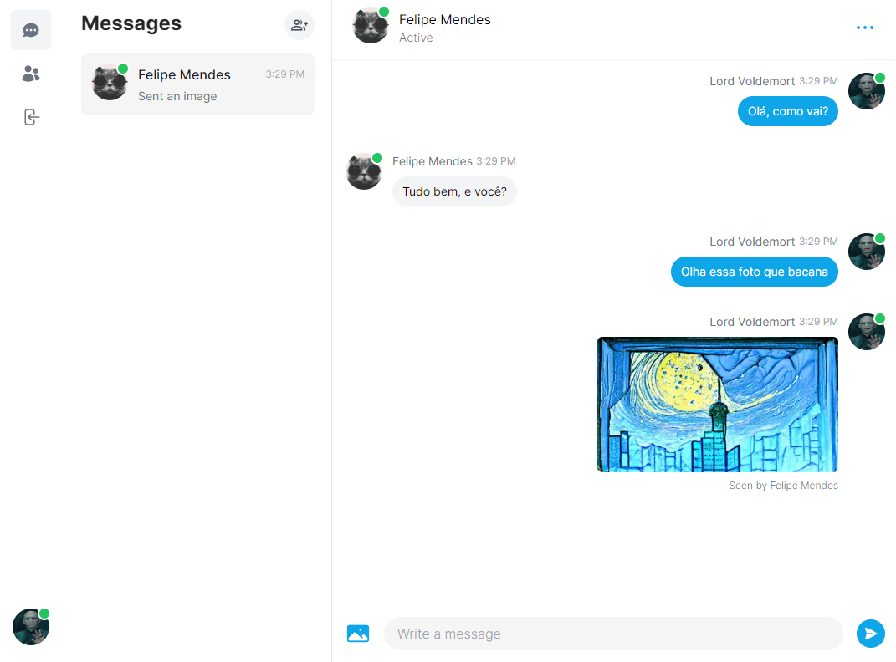
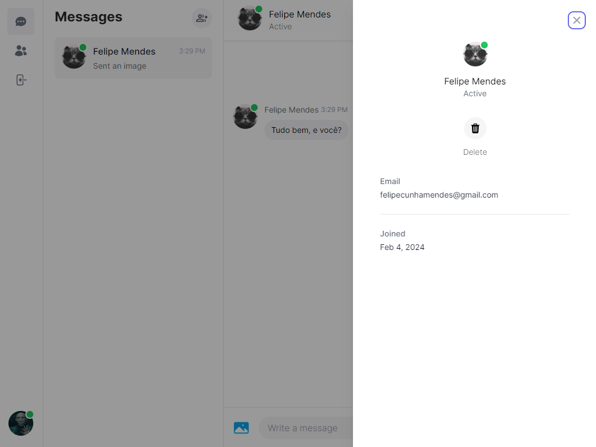
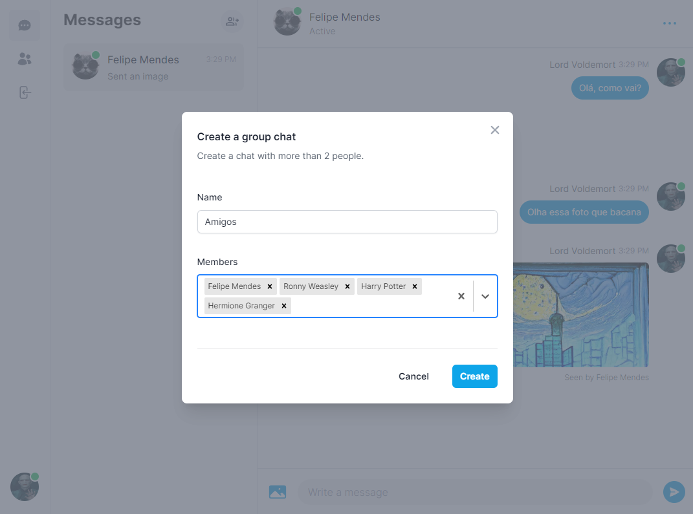
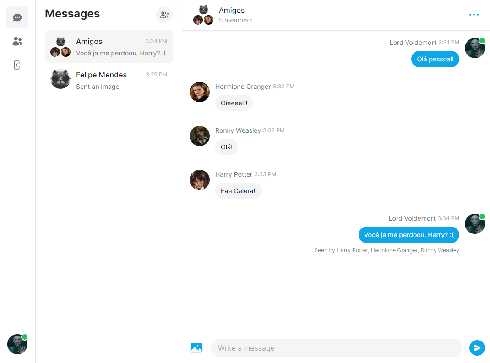
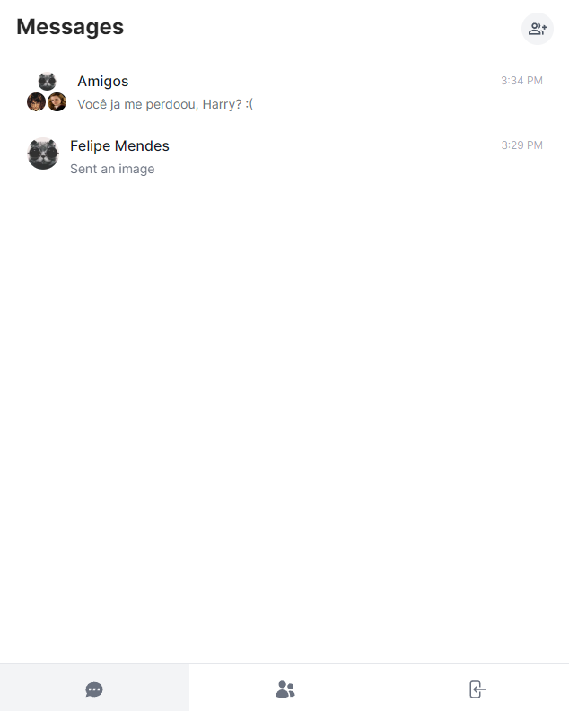
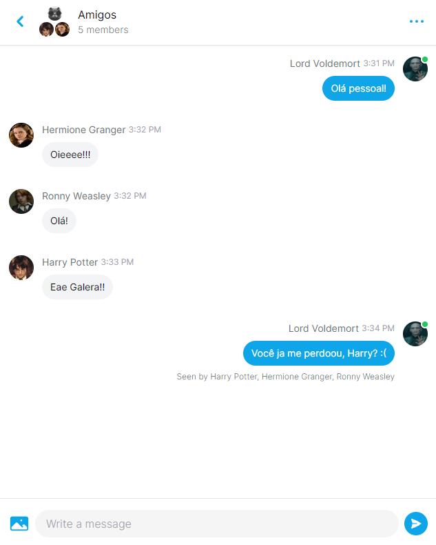

# Message App

### Como Executar

1. Clone o repositório
   ```bash
   git clone https://github.com/felipolis/message-app.git
   ```
2. Preencha as varaveis de ambiente
   ```bash
   cp .env.example .env
   ```
3. Instale as dependencias
   ```bash
   npm install
   npm run dev
   ```

### Layout







